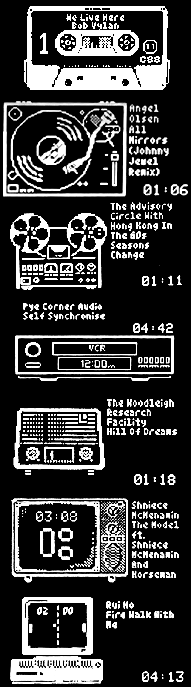

# LyMonS

[](https://github.com/shunte88/LyMonS/actions/workflows/release-pi.yml)
[](https://www.gnu.org/licenses/gpl-3.0)
[](https://www.raspberrypi.org/)

**An LMS Monitor For The Future**

> LyMonS version 0.2.5 | Built: 2026-02-10

OLED information display control program for [piCorePlayer](https://www.picoreplayer.org/) or other Raspberry Pi and Lyrion Music Server (formerly Logitech Media Server) based audio device.


## 📥 Download

Pre-compiled binaries for Raspberry Pi are available on the [binaries branch](https://github.com/shunte88/LyMonS/tree/binaries):

- **32-bit (armv7)** - Pi 3, 4, Zero 2 W: [lymons-latest-pcp-armv7.tgz](https://github.com/shunte88/LyMonS/raw/binaries/latest/lymons-latest-pcp-armv7.tgz)
- **64-bit (aarch64)** - Pi 4, 5, 400: [lymons-latest-pcp-aarch64.tgz](https://github.com/shunte88/LyMonS/raw/binaries/latest/lymons-latest-pcp-aarch64.tgz)

### Quick Install

```bash
# Download for your Pi (32-bit example)
wget https://github.com/shunte88/LyMonS/raw/binaries/latest/lymons-latest-pcp-armv7.tgz

# Extract
tar xzf lymons-latest-pcp-armv7.tgz

# Install
cd lymons-*-pcp-armv7
sudo ./install.sh

# Configure
sudo nano /etc/lymons/lymons.yaml
```

**Building from source?** See [CROSS_COMPILE.md](CROSS_COMPILE.md) for cross-compilation instructions.

### Features
- Oled drivers loaded on demand - delete the ones you don't use and save space
- SVG are utilized enabling support on many different OLED displays
- Mono, Gray4, and Color supported - depending ondisplay you use
- SVG are lightweight external files, embeded graphic are not stored in memory
- Track details are displayed only when playing
- Display features independant scrolling of track details as required.
- When playing, remaining time can be displayed rather than total time
- Audio attributes, volume, sample depth, and sample rate are shown
- Player attributes, shuffle, repeat, and fidelity glyphs are shown
- A retro clock is displayed when the audio is paused or stopped.
- Display regions are utilized for alignment, text wrapping, and layout
- You can display current weather and time. Requires an API key
- Weather descriptions can be translated to any language, however the
  display of same is not fully supported, Japanese, Korean, Chinese,
  and cyrilic languages are not supported (TBD)
- Automatically sets the brightness of the display at dawn and dusk.
- Multiple audio visualization modes are supported
- Multiple visualization styles are supported
- If monitoring from a separate device animations can be displayed as the track plays
- Alternatively can also be displayed instead of a visualization as the track plays
- Written in Rust - robust and memory safe

### Options
```bash
Usage: lymons --name "NAME" [OPTIONS...]
OLED information display for piCorePlayer or other Raspberry Pi and LMS based audio device.

  -n, --name PLAYERNAME      Name of the squeeze device to monitor
  -o, --oled [OLEDTYPE]      Specify OLED "driver" type (see options below)
  -r, --remain               Display remaining time rather than track time
  -S, --scroll [SCROLLMODE]  Label scroll mode: cylon, or loop
  -V, --verbose              Maximum log level
  -z, --splash               Show Splash Screen
  -e, --egg                  Show animated easter eggs wh track playing

Supported OLED types:
    SH1106
    SSD1306
    SSD1309
    SSD1322
    SHARP-memory

OLED Clock Fonts:
    7seg ........: Classic LCD Clock Font
    soldeco .....: Deco-Solid Font
    holdeco .....: Deco-Hollow Font
    holfestus ...: Festus Hollow 25x44
    solfestus ...: Festus Solid 25x44
    space1999 ...: Space 1999
    roboto ......: Roboto Thin
    solnoto .....: noto 25x44
    holnoto .....: noto fancy 25x44

```

### Visualizer Modes

Several visualizer modes are supported
- Stereo VU Meters - dBfs metered
- Stereo 12-band Spectrum Analysis
- Stereo 20-band Spectrum Analysis for wide displays
- Stereo Peak Meter - dBfs metered
- Downmix (visual data only) Peak Meter
- Large Downmix (visual data only) VU meter
- Large Downmix (visual data only) Spectrum
- All-In-One - track details and spectrum/VU "swoosh" - other keywords to come
- All-In-One - fixed mode  - other keywords to come
- Wave Forms - wigly waves - coming soon
- Easter Eggs - fixed mode (use --egg <<name>>)

### Installation

There are two modes of operation:

- LyMonS installed on piCore Player, consuming visualization data directly
- LyMonS installed on an alternate device, the LMS Server for example, consuming streamed visualization data

# Prerequisites

If you are intending to consume visualization data you need to configure squeezelite to expose the shared memory

From the Squeezlite page of the pCP web frontend type 1 in the "m" ALSA parameter section

And, in the Various Options add *-v*

See the squeezelite page for more details

## Easter Eggs
<p>


There are several "easter egg" modes provided for those setups that cannot process the audio data for visualization.
That said theres nothing stopping you using them as your main visualization.

There are currently 7 easter egg modes:
- <b>[cassette]</b> Compact Cassette, as visually correct as possible given the OLED limitations.  Hubs turn and the tape window shows the track "progress"
- <b>[technics]</b> Technics SL-1200, as visually correct as possible given the OLED limitations.  Tone arm traverses platter to indicate progress.
- <b>[reel2reel]</b> Open Reel To Reel, pure fantasy. Reels rotate, minor animation.
- <b>[vcr]</b> VCR with flashing 12:00 AM clock! No additional animation - the clock is annoying enough.
- <b>[radio40]</b> An large ornate radio. Minor animation, radio changes station as track progresses.
- <b>[radio50]</b> An old bakelite radio. Minor animation, radio changes station as track progresses.
- <b>[tvtime]</b> An old analog TV in all its 5x4 glory... VHF or UHF... no it's currently blank
- <b>[pctime]</b> A crusty old IBM PS/2 clone... simple animation just for fun
- <b>[bass]</b> A rubbish bass guitar - and why not...

Specify --egg <name> to display eggs on track playback
</p>
These are just a fun display mode where visualization is not possible.


## Like The App - Git The Shirt

Team Badger shirts and other goodies are available at [shunte88](https://www.zazzle.com/team_badger_t_shirt-235604841593837420)

