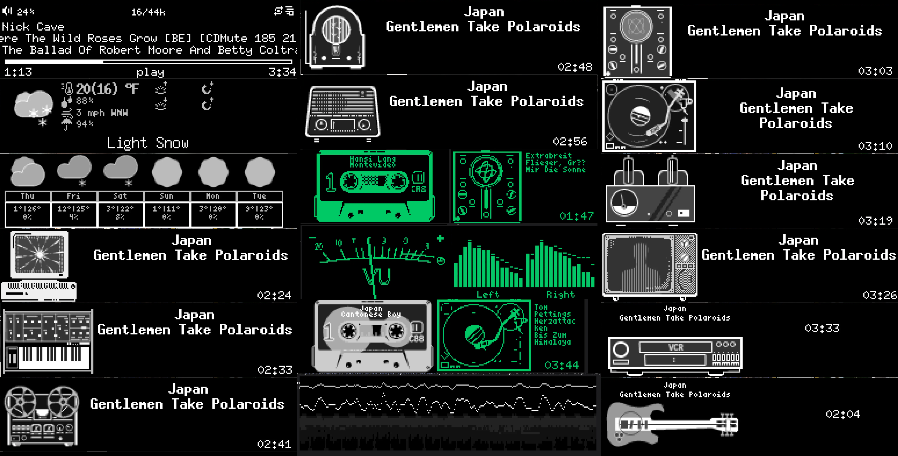

# LyMonS

[](https://github.com/shunte88/LyMonS/actions/workflows/release-pi.yml)
[](https://www.gnu.org/licenses/gpl-3.0)
[](https://www.raspberrypi.org/)


**An LMS Monitor For The Future**

OLED information display control program for [piCorePlayer](https://www.picoreplayer.org/) or other Raspberry Pi and Lyrion Music Server (formerly Logitech Media Server) based audio device.


## Download

Pre-compiled binaries for Raspberry Pi are available on the [binaries branch](https://github.com/shunte88/LyMonS/tree/binaries):

- **32-bit (armv7)** - Pi 3, 4, Zero 2 W: [lymons-latest-pcp-armv7.tgz](https://github.com/shunte88/LyMonS/raw/binaries/latest/lymons-latest-pcp-armv7.tgz)
- **64-bit (aarch64)** - Pi 4, 5, 400: [lymons-latest-pcp-aarch64.tgz](https://github.com/shunte88/LyMonS/raw/binaries/latest/lymons-latest-pcp-aarch64.tgz)

### Quick Install

```bash
# Download for your Pi (32-bit example)
wget https://github.com/shunte88/LyMonS/raw/binaries/latest/lymons-latest-pcp-armv7.tgz

# Extract
tar xzf lymons-latest-pcp-armv7.tgz

# Install
cd lymons-*-pcp-armv7
sudo ./install.sh

# Configure
sudo nano /etc/lymons/lymons.yaml
```

**Building from source?** See [CROSS_COMPILE.md](CROSS_COMPILE.md) for cross-compilation instructions.

### Features
- OLED drivers loaded on demand — delete the ones you don't use and save space
- SVG rendering gives clean, sharp graphics across many different OLED displays
- Mono, Gray4, and Color support depending on the display you use
- SVGs are lightweight external files, not baked into the binary
- Track details are displayed only when playing
- Display features independent scrolling of track details as required
- When playing, remaining time can be displayed rather than total time
- Audio attributes — volume, sample depth, and sample rate — are shown
- Player attributes — shuffle, repeat, and fidelity glyphs — are shown
- A retro clock is displayed when the audio is paused or stopped
- Display regions handle alignment, text wrapping, and layout
- Current weather and time display. Requires a free API key
- Weather descriptions can be translated to any language, though Japanese, Korean, Chinese, and Cyrillic scripts are not yet fully supported
- Automatically sets display brightness at dawn and dusk
- Multiple audio visualization modes, see below
- If monitoring from a separate device, animations can be displayed as the track plays
- Written in Rust — robust and memory safe

### Options
```bash

Usage: LyMonS [OPTIONS] --name <name>

Options:
  -v, --debug              Enable debug log level
  -N, --name <name>        LMS player name to monitor
  -W, --weather <weather>  Weather API key,units,transl,latitude,longitude [default: ]
  -z, --scroll <scroll>    Text display scroll mode [default: cylon] [possible values: loop, loopleft, cylon]
  -r, --remain             Display Remaining Time rather than Total Time
  -F, --font <font>        Clock font to use [default: 7seg] [possible values: 7seg, holdeco, holfestus, noto, roboto, soldeco, solfestus, space1999]
  -E, --eggs <eggs>        Easter Egg Animation [default: none] [possible values: bass, cassette, ibmpc, moog, pipboy, radio40, radio50, reel2reel, scope, technics, tubeamp, tvtime, vcr, none]
      --no-splash          Skip splash screen (shown by default)
  -k, --metrics            Display device metrics
  -c, --config <config>    monitor config file [default: config.toml]
      --i2c-bus <i2c-bus>  I2C bus device path for OLED display (e.g., /dev/i2c-1) [default: /dev/i2c-1]
  -d, --driver <driver>    Display driver type for emulator, overrides config (ssd1306, ssd1309, ssd1322, sh1106, sharpmemory) [possible values: ssd1306, ssd1309, ssd1322, sh1106, sharpmemory]
  -a, --viz <viz>          Visualization, meters, VU, Peak, Histograms, and more [default: no_viz] [possible values: aio_hist_mono, aio_vu_mono, combination, hist_mono, hist_stereo, peak_mono, peak_stereo, vu_mono, vu_stereo, waveform_spectrum, no_viz]
  -h, --help               Print help
  -V, --version            Print version

LyMonS:
LMS monitor

	Display LMS details and animations
	Clock, Weather, Meters, and more


Supported OLED types:
    SH1106
    SSD1306
    SSD1309
    SSD1322
    SHARP-memory

OLED Clock Fonts:
    7seg ........: Classic LCD Clock Font
    soldeco .....: Deco-Solid Font
    holdeco .....: Deco-Hollow Font
    holfestus ...: Festus Hollow 25x44
    solfestus ...: Festus Solid 25x44
    space1999 ...: Space 1999
    roboto ......: Roboto Thin
    solnoto .....: Noto 25x44
    holnoto .....: Noto Fancy 25x44

```

### Visualizer Modes

Several visualizer modes are supported:
- Stereo VU Meters — dBFS metered
- Stereo 12-band Spectrum Analysis
- Stereo 20-band Spectrum Analysis for wide displays
- Stereo Peak Meter — dBFS metered
- Downmix Peak Meter
- Large Downmix VU meter
- Large Downmix Spectrum
- All-In-One — track details alongside spectrum or VU meter
- Wave Forms — coming soon
- Easter Eggs — fixed mode (use `--egg <name>`)

### Installation

LyMonS can run in two configurations:

**On the player device** — installed directly on a piCorePlayer or any Pi running Squeezelite. LyMonS reads audio data from Squeezelite's shared memory, which gives it access to real-time PCM data for VU meters, peak meters, and spectrum analysis.

**On a separate device** — installed on another machine on the same network, pointing at the LMS player by name. In this case LyMonS connects to the [visionon](https://github.com/shunte88/visionon) streaming daemon running on the player device and receives audio metrics over the network. LyMonS figures out which approach to use on its own — if shared memory is available it uses it, otherwise it connects to visionon. No flags, no configuration switches.

The only thing you need for remote visualization is the visionon daemon running on the player device. Point LyMonS at the player name and the rest is handled for you.

# Prerequisites

If you intend to use visualization you need to configure Squeezelite to expose its shared memory.

From the Squeezelite page of the pCP web frontend, type `1` in the "m" ALSA parameter section and add `-v` in the Various Options field.

See the Squeezelite page for more details.

For **remote visualization** (LyMonS on a separate device), you also need the [visionon](https://github.com/shunte88/visionon) daemon running on the player device. Visionon is a lightweight process that reads Squeezelite's shared memory and streams the audio metrics out over HTTP. Once it's running, LyMonS connects to it automatically using the player's IP.

## Easter Eggs



<p>
There are several "easter egg" modes for setups that can't or don't want to process audio data for visualization. There's nothing stopping you using them as your main display mode either.

There are currently 10 easter egg modes:
- <b>[cassette]</b> Compact Cassette, as visually accurate as the OLED allows. Hubs turn and the tape loops from one hub to the other with the tape window showing track progress.
- <b>[technics]</b> Technics SL-1200, as visually accurate as the OLED allows. Tone arm traverses the platter to indicate progress.
- <b>[reel2reel]</b> Open Reel To Reel, pure fantasy. Reels rotate, minor animation.
- <b>[vcr]</b> VCR with flashing 12:00 AM clock. No additional animation — the clock is annoying enough.
- <b>[radio40]</b> A large ornate radio. Minor animation, station changes as the track progresses.
- <b>[radio50]</b> An old Bakelite radio. Minor animation, station changes as the track progresses.
- <b>[tvtime]</b> An old analog TV in all its 5x4 glory. VHF or UHF — no, a dancing news reader.
- <b>[ibmpc]</b> A crusty old IBM PS/2 clone. Simple starfield animation, just for fun.
- <b>[bass]</b> A rubbish bass guitar — and why not.
- <b>[pipboy]</b> It's Pip-Boy.

Specify `--egg <name>` to display an easter egg during track playback.
</p>

## Like The App - Git The Shirt

Team Badger shirts and other goodies are available at [shunte88](https://www.zazzle.com/team_badger_t_shirt-235604841593837420)
