# LyMonS

[](https://github.com/shunte88/LyMonS/actions/workflows/release-pi.yml)
[](https://www.gnu.org/licenses/gpl-3.0)
[](https://www.raspberrypi.org/)


[ Like my work, then Buy Me A Coffee](https://buymeacoffee.com/shunte88)

**An LMS Monitor For The Future**

OLED information display control program for [piCorePlayer](https://www.picoreplayer.org/) or other Raspberry Pi and Lyrion Music Server (formerly Logitech Media Server) based audio device.


## Download

Pre-compiled binaries for Raspberry Pi are available on the [binaries branch](https://github.com/shunte88/LyMonS/tree/binaries):

- **32-bit (armv7)** - Pi 3, 4, Zero 2 W: [lymons-latest-pcp-armv7.tgz](https://github.com/shunte88/LyMonS/raw/binaries/latest/lymons-latest-pcp-armv7.tgz)
- **64-bit (aarch64)** - Pi 4, 5, 400: [lymons-latest-pcp-aarch64.tgz](https://github.com/shunte88/LyMonS/raw/binaries/latest/lymons-latest-pcp-aarch64.tgz)

### Quick Install

```bash
# Download for your Pi (32-bit example)
wget https://github.com/shunte88/LyMonS/raw/binaries/latest/lymons-latest-pcp-armv7.tgz

# Extract
tar xzf lymons-latest-pcp-armv7.tgz

# Install
cd lymons-*-pcp-armv7
sudo ./install.sh
# and follow the directions...

```

**Building from source?** See [CROSS_COMPILE.md](CROSS_COMPILE.md) for cross-compilation instructions.

### Features
- OLED drivers loaded on demand — delete the ones you don't use and save space
- SVG rendering gives clean, sharp graphics across many different OLED displays
- Mono, Gray4, and Color support depending on the display you use
- SVGs are lightweight external files, not baked into the binary
- Track details are displayed only when playing
- Display features independent scrolling of track details as required
- When playing, remaining time can be displayed rather than total time
- Audio attributes — volume, sample depth, and sample rate — are shown
- Player attributes — shuffle, repeat, and fidelity glyphs — are shown
- A retro clock is displayed when the audio is paused or stopped
- Display regions handle alignment, text wrapping, and layout
- Current weather and time display. Requires a free API key from [tommorow.io](https://www.tomorrow.io/a/faq/weather-api/how-to-get-a-weather-api-key/)
- Weather descriptions can be translated to any language, though Japanese, Korean, Chinese, and Cyrillic scripts are not yet fully supported
- Automatically sets display brightness at dawn and dusk
- Multiple audio visualization modes, see below
- If monitoring from a separate device, animations can be displayed as the track plays
- Written in Rust — robust and memory safe

### Options
```bash

Usage: LyMonS [OPTIONS] --name <name>

LMS monitor — worth the squeeze

Usage: LyMonS [OPTIONS]

Options:
  -c, --config <CONFIG>
          Path to YAML config file (overrides default search)
  -v, --debug
          Enable debug logging
  -N, --name <NAME>
          LMS player name to monitor (required unless set in config file)
  -W, --weather <WEATHER>
          Weather: API key,units,lang,latitude,longitude (comma-separated)
      --weather-api <WEATHER_API>
          Tomorrow.io API key (overrides --weather key field)
      --weather-units <WEATHER_UNITS>
          Weather units: metric (default) or imperial (overrides --weather units field)
      --weather-lang <WEATHER_LANG>
          Weather language/translation code (overrides --weather lang field)
      --lat <LAT>
          Latitude — overrides config file and GeoIP
      --lon <LON>
          Longitude — overrides config file and GeoIP
  -z, --scroll <SCROLL>
          Text scroll mode [possible values: loop, loopleft, cylon]
  -r, --remain
          Show remaining time instead of total duration
  -F, --text_font <TEXT_FONT>
          TTF text font name (must have ./data/{name}-text.zip)
  -f, --text_font_size <TEXT_FONT_SIZE>
          TTF text font size (must have ./data/{name}-text.zip)
  -C, --clock_font <CLOCK_FONT>
          Clock font [possible values: 7seg, dejavu, dotty, gawker, ledreal, mackintosh, marvel, moomy, noto, poppins, roboto]
  -E, --eggs <EGGS>
          Easter egg animation [possible values: bass, blackfly, cassette, ibmpc, moog, pipboy, radio40, radio50, reel2reel, scope, technics, tubeamp, tvtime, vcr, none]
      --no-splash
          Skip splash screen
  -k, --metrics
          Show device metrics overlay
      --i2c-bus <I2C_BUS>
          I2C bus device path [default: /dev/i2c-1]
  -d, --driver <DRIVER>
          Display driver (emulator / config override) [possible values: ssd1306, ssd1309, ssd1322, sh1106, sh1122, sharpmemory, st7789]
  -a, --viz <VIZ>
          Visualizer type [possible values: combination, hist_aio, hist_mono, hist_stereo, peak_mono, peak_stereo, vu_aio, vu_mono, vu_stereo, waveform_spectrum, no_viz]
      --hist-scheme <HIST_SCHEME>
          Histogram colour scheme [possible values: classic, ocean, fire, neon]
      --dump-config
          Print fully merged config and exit
  -h, --help
          Print help
  -V, --version
          Print version

LyMonS:
LMS monitor

	Display LMS details and animations
	Clock, Weather, Meters, and more


Supported OLED types:
    SH1106
    SH1122
    SSD1306
    SSD1309
    SSD1322
    SHARP-memory
    ST7789

OLED Clock Fonts:
    7seg ........: Classic LCD Clock Font
    dejavu ......: DejaVu - or is that VU
    dotty .......: Dotmatrix style font
    gawker ......: Get an eyefull, use Gawker
    ledreal .....: A slightly more complex LED font
    mackintosh ..: C.R. Mackintosh perfection
    marvel ......: Marvel movie poster font
    moomy .......: More fontage, it's moomy
    noto ........: Clasic san-serif Noto
    poppins .....: Poppins, oh yes...
    roboto ......: Roboto Thin

```

## Screenshots

### Playback Scroller

| SSD1309 (128×64 mono) | SSD1322 (256×64 gray4) | ST7789 (320×170 color) |
|:---:|:---:|:---:|
| 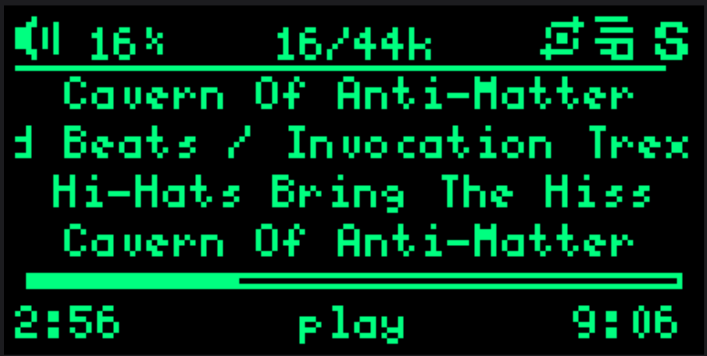 | 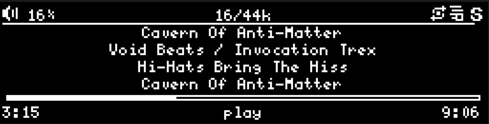 | 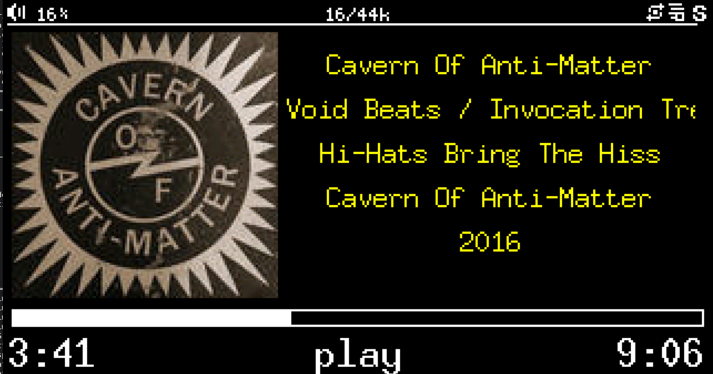 |

TTF font on ST7789:

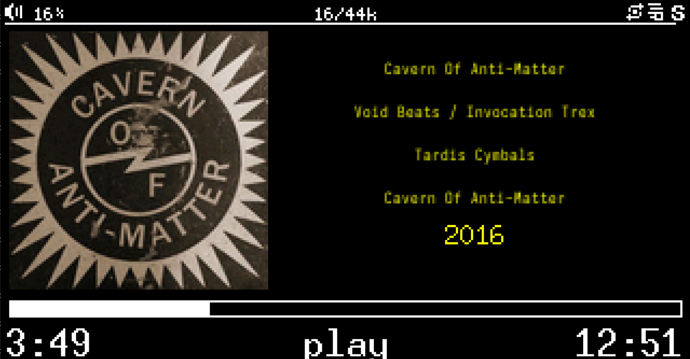

### Clock — Marvel Font

| SSD1309 (128×64 mono) | SSD1322 (256×64 gray4) | ST7789 (320×170 color) |
|:---:|:---:|:---:|
| 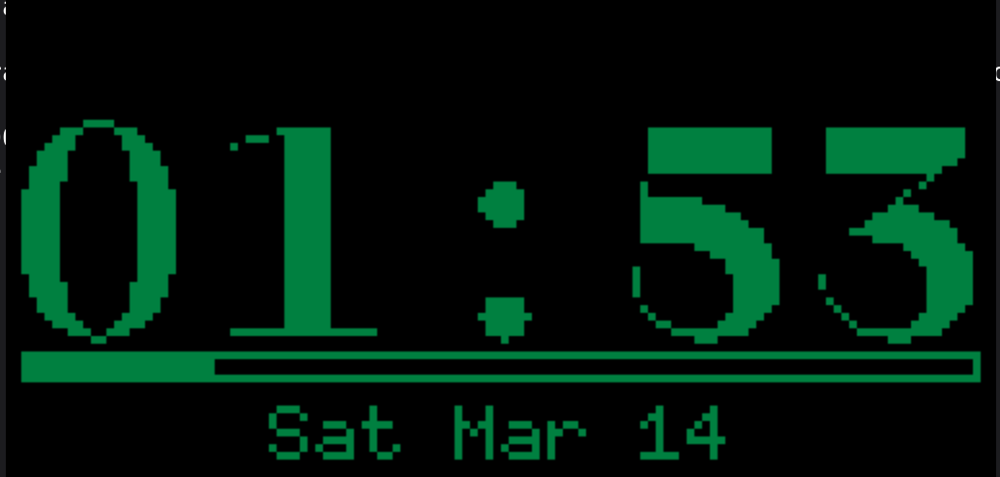 |  | 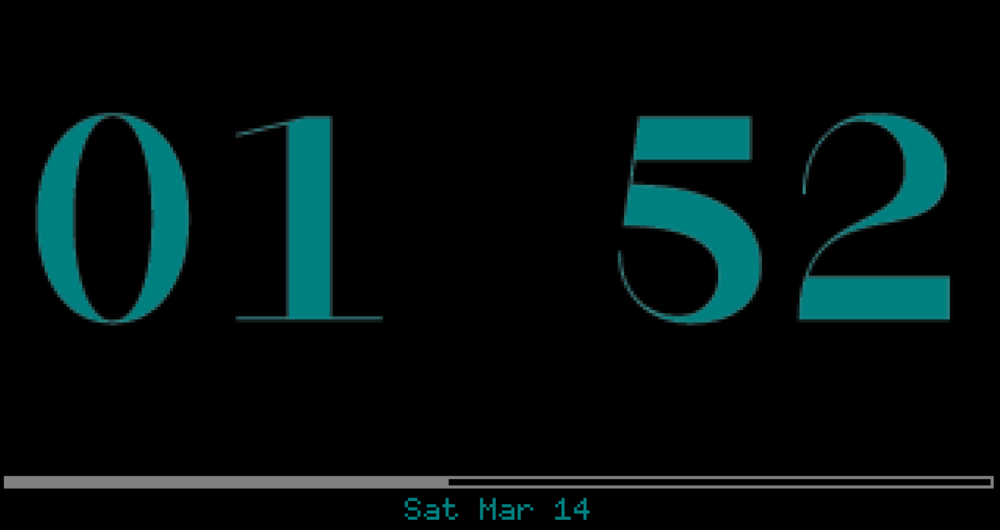 |

### Weather — Current Conditions

| SSD1322 (256×64 gray4) | ST7789 (320×170 color) |
|:---:|:---:|
| 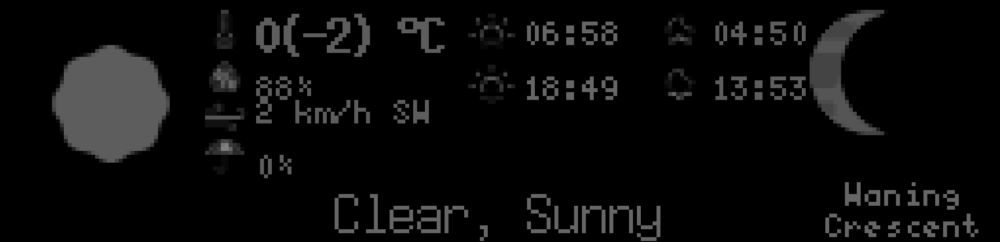 | 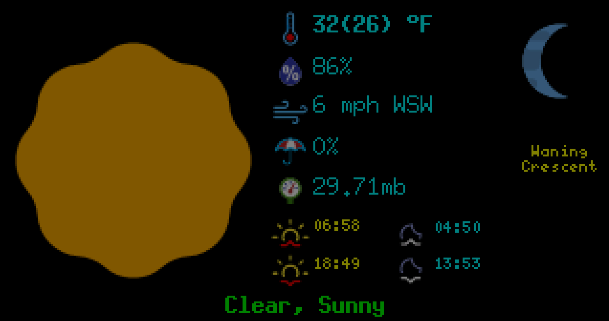 |

### Weather — Forecast

| SSD1309 (128×64 mono) | SSD1322 (256×64 gray4) | ST7789 (320×170 color) |
|:---:|:---:|:---:|
| 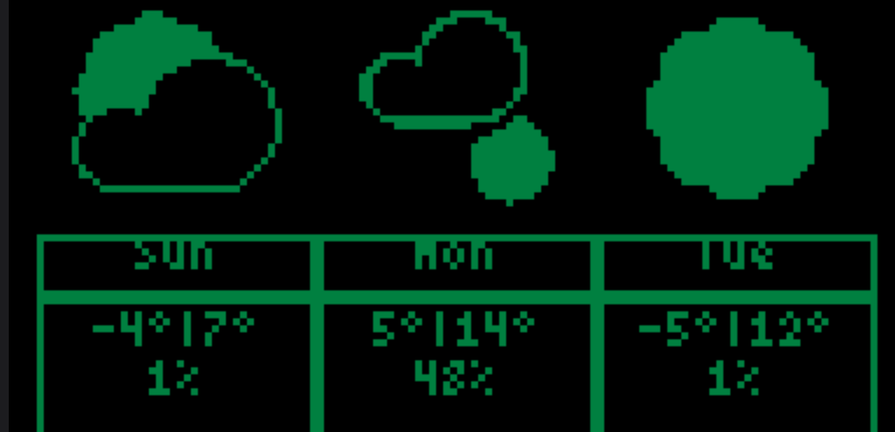 | 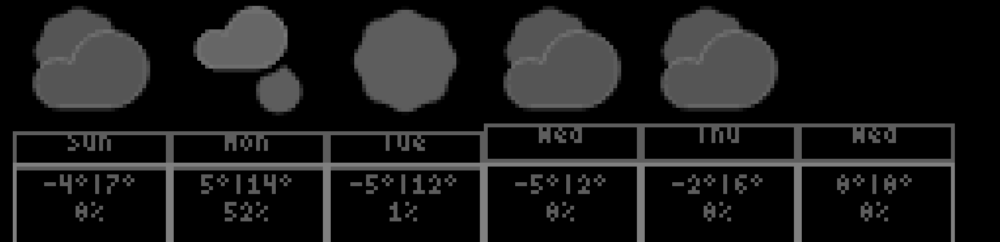 | 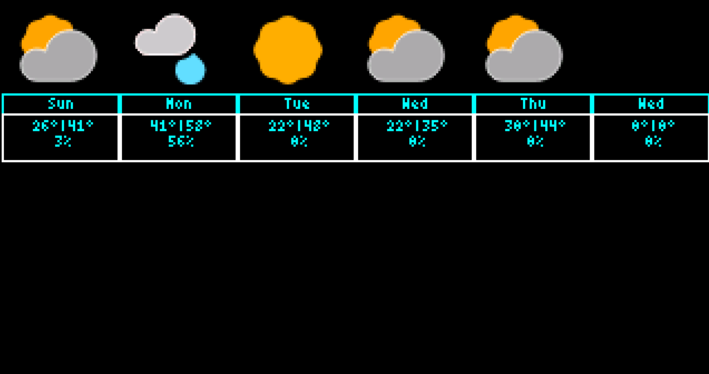 |

### Visualizer Modes

Several visualizer modes are supported:
- Stereo VU Meters — dBFS metered
- Stereo 12-band Spectrum Analysis
- Stereo 20-band Spectrum Analysis for wide displays
- Stereo Peak Meter — dBFS metered
- Downmix Peak Meter
- Large Downmix VU meter
- Large Downmix Spectrum
- All-In-One — track details alongside spectrum or VU meter
- Wave Forms — coming soon
- Easter Eggs — fixed mode (use `--egg <name>`)

### Installation

LyMonS can run in two configurations:

**On the player device** — installed directly on a piCorePlayer or any Pi running Squeezelite. LyMonS reads audio data from Squeezelite's shared memory, which gives it access to real-time PCM data for VU meters, peak meters, and spectrum analysis.

**On a separate device** — installed on another machine on the same network, pointing at the LMS player by name. In this case LyMonS connects to the [visionon](https://github.com/shunte88/visionon) streaming daemon running on the player device and receives audio metrics over the network. LyMonS figures out which approach to use on its own — if shared memory is available it uses it, otherwise it connects to visionon. No flags, no configuration switches.

The only thing you need for remote visualization is the visionon daemon running on the player device. Point LyMonS at the player name and the rest is handled for you.

# Prerequisites

If you intend to use visualization you need to configure Squeezelite to expose its shared memory.

From the Squeezelite page of the pCP web frontend, type `1` in the "m" ALSA parameter section and add `-v` in the Various Options field.

See the Squeezelite page for more details.

For **remote visualization** (LyMonS on a separate device), you also need the [visionon](https://github.com/shunte88/visionon) daemon running on the player device. Visionon is a lightweight process that reads Squeezelite's shared memory and streams the audio metrics out over HTTP. Once it's running, LyMonS connects to it automatically using the player's IP.

## Easter Eggs

There are several "easter egg" modes for setups that can't or don't want to process audio data for visualization. There's nothing stopping you using them as your main display mode either.

#### Cassette

| SSD1309 (128×64 mono) | SSD1322 (256×64 gray4) | ST7789 (320×170 color) |
|:---:|:---:|:---:|
| 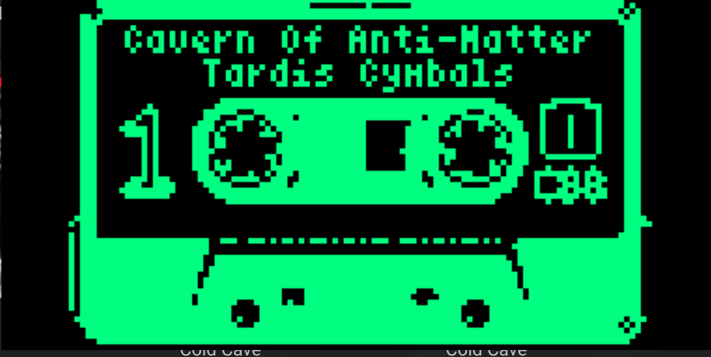 | 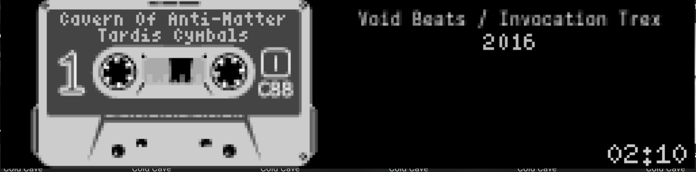 | 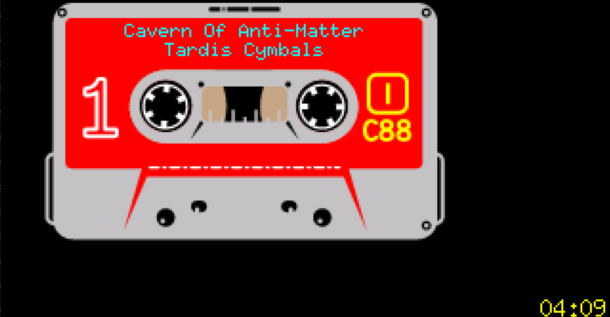 |

#### Oscilloscope

| SSD1309 (128×64 mono) | SSD1322 (256×64 gray4) | ST7789 (320×170 color) |
|:---:|:---:|:---:|
| 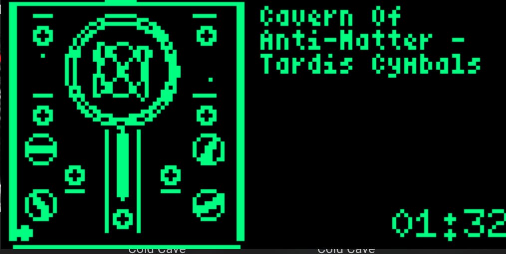 | 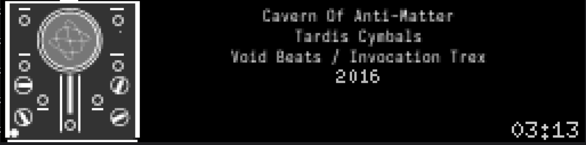 | 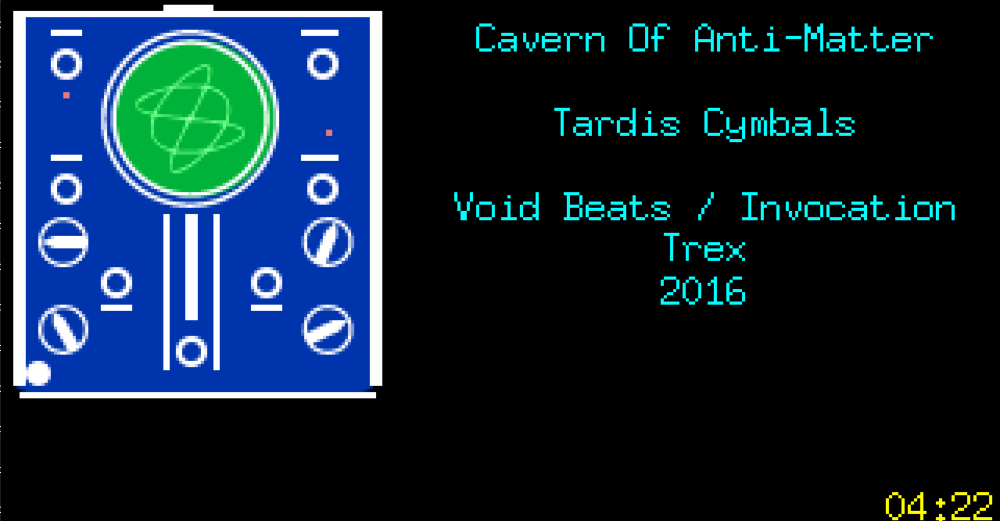 |

There are currently 10 easter egg modes:
- <b>[cassette]</b> Compact Cassette, as visually accurate as the OLED allows. Hubs turn and the tape loops from one hub to the other with the tape window showing track progress.
- <b>[technics]</b> Technics SL-1200, as visually accurate as the OLED allows. Tone arm traverses the platter to indicate progress.
- <b>[reel2reel]</b> Open Reel To Reel, pure fantasy. Reels rotate, minor animation.
- <b>[vcr]</b> VCR with flashing 12:00 AM clock. No additional animation — the clock is annoying enough.
- <b>[radio40]</b> A large ornate radio. Minor animation, station changes as the track progresses.
- <b>[radio50]</b> An old Bakelite radio. Minor animation, station changes as the track progresses.
- <b>[tvtime]</b> An old analog TV in all its 5x4 glory. VHF or UHF — no, a dancing news reader.
- <b>[ibmpc]</b> A crusty old IBM PS/2 clone. Simple starfield animation, just for fun.
- <b>[bass]</b> A rubbish bass guitar — and why not.
- <b>[pipboy]</b> It's Pip-Boy.

Specify `--egg <name>` to display an easter egg during track playback.

## Layout System

LyMonS uses a declarative YAML layout system to define where and how every element appears on screen. All positions, sizes, fonts, colors, and alignment are data — no recompilation needed. Driver-specific overrides let each display have its own tuned layout without touching shared definitions.

### How It Works

Layouts are defined in `assets/layout.yaml` (the base, targeting 128×64 mono displays). Driver-specific overrides are placed alongside the driver in `assets/{driver}/layout.yaml` — for example `assets/ssd1322/layout.yaml` for the 256×64 gray4 display, or `assets/st7789/layout.yaml` for the 320×170 color display.

When LyMonS starts it loads the base layout, then merges the driver override on top. The merge is **additive at the field level** — the override can add new fields or change individual field properties without having to redeclare fields it doesn't touch.

### Layout File Structure

```yaml
components:
  my_panel:                     # reusable group of fields
    fields:
      - name: status_bar
        type: status_bar
        x: "0"
        y: "2"
        width: "parent.width"
        height: "9"

templates:
  playback:                     # page shown during track playback
    variants:
      - name: default           # catch-all variant (no match: rule)
        regions:
          - component: my_panel
            x: "0"
            y: "0"
            width: "display.width"
            height: "display.height"
```

Simple pages — like easter egg overlays — can define fields inline directly in the variant, skipping the component indirection entirely:

```yaml
templates:
  easter_egg_cassette:
    variants:
      - name: default
        fields:
          - name: artist
            type: label
            x: "18"
            y: "6"
            width: "90"
            height: "6"
            font: font_4x6
            horizontal_alignment: Center
```

### Expressions

Position and size values are expression strings, not bare numbers. The following variables are available:

| Variable | Meaning |
|---|---|
| `display.width` | Full display width in pixels |
| `display.height` | Full display height in pixels |
| `parent.width` | Width of the enclosing region |
| `parent.height` | Height of the enclosing region |
| `font_height` | Character height of the field's font |
| `<name>.top` `.bottom` `.left` `.right` `.width` `.height` | Geometry of any previously defined field |

Arithmetic operators `+` `-` `*` `/` and parentheses are supported. Examples:

```yaml
x: "display.width / 2"              # centre of display
y: "status_bar.bottom + 2"          # 2px below the status bar
width: "display.width - 43"         # fill to near right edge
height: "parent.height - 16"        # leave room for time at bottom
```

Because expressions reference `display.width`, the same component definition often adapts correctly to both 128px and 256px displays without a driver override.

### Field Properties

| Property | Values | Default |
|---|---|---|
| `type` | `label`, `scrolling_text`, `status_bar`, `track_progress_bar`, `info_line`, `clock_digits`, `weather_icon`, `weather_glyph`, `cover_image`, `custom` | — |
| `x` / `y` | integer or expression | `"0"` |
| `width` / `height` | integer or expression | `"parent.width"` / `"0"` |
| `font` | `font_4x6` `font_5x8` `font_6x10` `font_7x13` `font_7x13_bold` `font_10x20` etc. | type default |
| `fg_color` | `White` `Yellow` `Cyan` `Red` `Green` `Blue` `Orange` `Magenta` or `{r, g, b}` | `White` |
| `scrollable` | `true` / `false` | `false` |
| `horizontal_alignment` | `Left` `Center` `Right` | `Left` |
| `vertical_alignment` | `Top` `Middle` `Bottom` | `Top` |

### Variant Matching

A template can have multiple variants selected by display characteristics. The first matching variant wins; an entry with no `match:` block is a catch-all.

```yaml
templates:
  weather_forecast:
    variants:
      - name: color               # matches ST7789 specifically
        match:
          color_depth: [Rgb565]
        regions:
          - component: weather_forecast_6col_st7789
            ...

      - name: wide                # matches SSD1322 / SH1122
        match:
          category: [Large]
        regions:
          - component: weather_forecast_ext_cols
            ...

      - name: default             # all other displays
        regions:
          - component: weather_forecast_3col
            ...
```

Match filters:

| Filter | Values |
|---|---|
| `category` | `Small` (128px), `Medium` (132px), `Large` (256px), `ExtraLarge` (320px+) |
| `color_depth` | `Monochrome`, `Gray4`, `Rgb565` |

### Driver Overrides

Place a `layout.yaml` file inside the driver's asset folder. The file uses the same format as the base — it only needs to contain what differs. Components and templates not mentioned in the override are inherited unchanged from the base.

**Example**: add artist and title to the Pip-Boy easter egg on the wide gray4 display, which shows only a clock by default:

```yaml
# assets/ssd1322/layout.yaml
templates:
  easter_egg_pipboy:
    variants:
      - name: default
        fields:
          - name: artist          # new — not in base template
            type: label
            x: "140"
            y: "3"
            width: "114"
            height: "28"
            font: font_4x6
            horizontal_alignment: Center
          - name: title           # new — not in base template
            type: label
            x: "140"
            y: "33"
            width: "114"
            height: "20"
            font: font_4x6
            horizontal_alignment: Center
          # time field is inherited from base — no need to redeclare it
```

### Easter Egg Field Names

Each easter egg template supports any combination of the following named fields. Fields not present in the template are simply not rendered — add whichever ones make sense for the available screen space on each display.

| Field name | Content |
|---|---|
| `artist` | Track artist |
| `title` | Track title |
| `album` | Album name |
| `album_artist` | Album artist |
| `combination` | `"Artist — Title"` combined scroller |
| `year` | Release year |
| `time` | Elapsed or remaining track time |

Set `scrollable: true` on any of these for a horizontal scroller (text slides when it overflows the field width). Use `type: label` with `scrollable: false` for word-wrapped static text.

### Error Reporting

Layout errors are reported at startup with enough context to find the problem quickly.

**YAML syntax or type error** (e.g. unknown font name, bad indentation):
```
ERROR layout: YAML error in ./assets/ssd1322/layout.yaml:
ERROR   unknown variant `font_4x66`, expected one of `font_4x6`, `font_5x7`, ...
ERROR   (in template 'easter_egg_pipboy')
WARN  layout: driver override ignored — using base layout only
```

**Expression evaluation error** (e.g. typo in a variable name, forward reference):
```
WARN  layout: easter_egg_reel2reel/default/time [x="display.widht - 43"]:
              unknown variable 'display.widht' — using 0
```

## Like The App - Git The Shirt

Team Badger shirts and other goodies are available at [shunte88](https://www.zazzle.com/team_badger_t_shirt-235604841593837420)

---

[ Like my work, then Buy Me A Coffee](https://buymeacoffee.com/shunte88)

