# LyMonS

[](https://github.com/shunte88/LyMonS/actions/workflows/release-pi.yml)
[](https://www.gnu.org/licenses/gpl-3.0)
[](https://www.raspberrypi.org/)
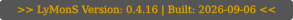

[ Like my work, then Buy Me A Coffee](https://buymeacoffee.com/shunte88)

**An LMS Monitor For The Future**

OLED information display control program for [piCorePlayer](https://www.picoreplayer.org/) or other Raspberry Pi, Orange Pi and Lyrion Music Server (formerly Logitech Media Server) based audio device.


## Download

Pre-compiled binaries are available on the [binaries branch](https://github.com/shunte88/LyMonS/tree/binaries):

**Raspberry Pi**

- **32-bit (armv6)** - Pi 1, Zero, Zero W: [lymons-latest-pcp-armv6.tgz](https://github.com/shunte88/LyMonS/raw/binaries/latest/lymons-latest-pcp-armv6.tgz)
- **32-bit (armv7)** - Pi 2, 3, 4, Zero 2 W: [lymons-latest-pcp-armv7.tgz](https://github.com/shunte88/LyMonS/raw/binaries/latest/lymons-latest-pcp-armv7.tgz)
- **64-bit (aarch64)** - Pi 4, 5, 400: [lymons-latest-pcp-aarch64.tgz](https://github.com/shunte88/LyMonS/raw/binaries/latest/lymons-latest-pcp-aarch64.tgz)

**Orange Pi** (Armbian / Debian / Ubuntu)

- **64-bit (aarch64)** - 5 / 5B / 5 Plus / 5 Pro / 5 Max / CM5 (RK3588), 3B (RK3566), 4 (RK3399), Zero 3 / Zero 2W (H618): [lymons-latest-opi-aarch64.tgz](https://github.com/shunte88/LyMonS/raw/binaries/latest/lymons-latest-opi-aarch64.tgz)

One package covers every current Orange Pi, Rockchip and Allwinner alike. Only
the older 32-bit boards (Zero / Zero LTS on H2+/H3, PC, PC Plus, One) fall
outside it and run the `armv7` package above.

See [Orange Pi and other non-Pi boards](#orange-pi-and-other-non-pi-boards) for
bus and GPIO setup, which differs from the Pi.

### Quick Install

```bash
# Download for your Pi (32-bit Pi 3, 4, Zero 2 W example)
wget https://github.com/shunte88/LyMonS/raw/binaries/latest/lymons-latest-pcp-armv7.tgz

# Extract
tar xzf lymons-latest-pcp-armv7.tgz

# Install
cd lymons-*-pcp-armv7
sudo ./install.sh

# and follow the directions...

```

**Building from source?** See [CROSS_COMPILE.md](CROSS_COMPILE.md) for cross-compilation instructions.

### Features
- OLED drivers loaded on demand, delete the ones you don't use and save space
- SVG rendering gives clean, sharp graphics across many different OLED displays
- Mono, Gray4, and Color support depending on the display you use
- SVGs are lightweight external files, not baked into the binary
- Track details are displayed only when playing
- Display features independent scrolling of track details as required
- When playing, remaining time can be displayed rather than total time
- Audio attributes: volume, sample depth, and sample rate, are shown
- Player attributes: shuffle, repeat, and fidelity glyphs, are shown
- A retro clock is displayed when the audio is paused or stopped
- Display regions handle alignment, text wrapping, and layout
- Current weather and time display. Requires a free API key from [tommorow.io](https://www.tomorrow.io/a/faq/weather-api/how-to-get-a-weather-api-key/)
- Weather descriptions can be translated to any language, though Japanese, Korean, Chinese, and Cyrillic scripts are not yet fully supported
- Automatically sets display brightness at dawn and dusk
- Multiple audio visualization modes, see below
- If monitoring from a separate device, animations can be displayed as the track plays
- Written in Rust: robust and memory safe

### Options
```bash

Usage: LyMonS [OPTIONS] --name <name>

LMS monitor, worth the squeeze

Usage: LyMonS [OPTIONS]

Options:
  -c, --config <CONFIG>
          Path to YAML config file (overrides default search)
  -v, --debug
          Enable debug logging
  -N, --name <NAME>
          LMS player name to monitor (required unless set in config file)
  -W, --weather <WEATHER>
          Weather: API key,units,lang,latitude,longitude (comma-separated)
      --weather-api <WEATHER_API>
          Tomorrow.io API key (overrides --weather key field)
      --weather-units <WEATHER_UNITS>
          Weather units: metric (default) or imperial (overrides --weather units field)
      --weather-lang <WEATHER_LANG>
          Weather language/translation code (overrides --weather lang field)
      --lat <LAT>
          Latitude, overrides config file and GeoIP
      --lon <LON>
          Longitude, overrides config file and GeoIP
  -z, --scroll <SCROLL>
          Text scroll mode [possible values: loop, loopleft, cylon]
  -r, --remain
          Show remaining time instead of total duration
  -F, --text_font <TEXT_FONT>
          TTF text font name (must have ./data/{name}-text.zip)
  -f, --text_font_size <TEXT_FONT_SIZE>
          TTF text font size (must have ./data/{name}-text.zip)
  -C, --clock_font <CLOCK_FONT>
          Clock font [possible values: 7seg, dejavu, dotty, gawker, ledreal, mackintosh, marvel, moomy, noto, poppins, roboto]
  -E, --eggs <EGGS>
          Easter egg animation [possible values: bass, blackfly, cassette, ibmpc, moog, pipboy, radio40, radio50, reel2reel, scope, technics, tubeamp, tvtime, vcr, none]
      --no-splash
          Skip splash screen
  -k, --metrics
          Show device metrics overlay
      --i2c-bus <I2C_BUS>
          I2C bus device path [default: /dev/i2c-1]
  -d, --driver <DRIVER>
          Display driver (emulator / config override) [possible values: ssd1306, ssd1309, ssd1322, sh1106, sh1107, sh1122, sharpmemory, st7789, st7796s]
  -a, --viz <VIZ>
          Visualizer type [possible values: combination, hist_aio, hist_mono, hist_stereo, peak_mono, peak_stereo, vu_aio, vu_mono, vu_stereo, waveform_spectrum, no_viz]
      --hist-scheme <HIST_SCHEME>
          Histogram color scheme [possible values: classic, ocean, fire, neon]
      --dump-config
          Print fully merged config and exit
  -h, --help
          Print help
  -V, --version
          Print version

LyMonS:
LMS monitor

	Display LMS details and animations
	Clock, Weather, Meters, and more


Supported OLED types:
    SH1106
    SH1107
    SH1122
    SSD1306
    SSD1309
    SSD1322
    SHARP-memory
    ST7789
    ST7796S

OLED Clock Fonts:
    7seg ........: Classic LCD Clock Font
    dejavu ......: DejaVu - or is that VU
    dotty .......: Dotmatrix style font
    gawker ......: Get an eyefull, use Gawker
    ledreal .....: A slightly more complex LED font
    mackintosh ..: C.R. Mackintosh perfection
    marvel ......: Marvel movie poster font
    moomy .......: More fontage, it's moomy
    noto ........: Clasic san-serif Noto
    poppins .....: Poppins, oh yes...
    roboto ......: Roboto Thin

```

## Screenshots

### Playback Scroller

| SSD1309 (128×64 mono) | SSD1322 (256×64 gray4) | ST7789 (320×170 color) |
|:---:|:---:|:---:|
| 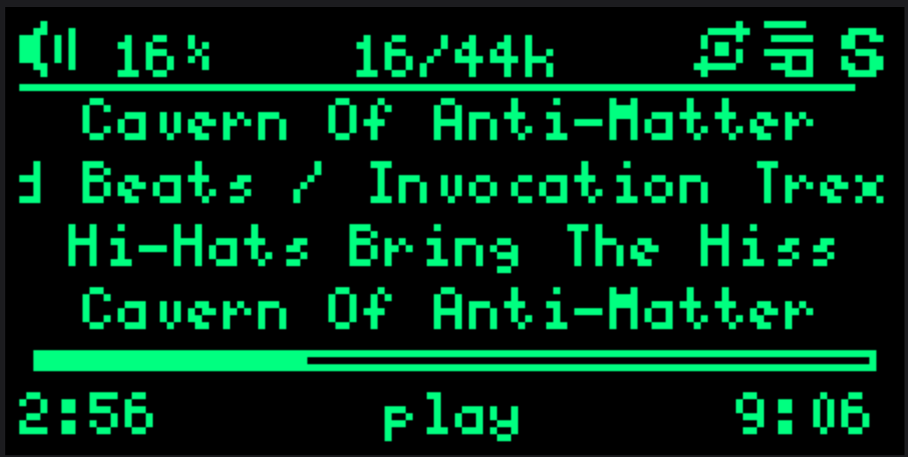 | 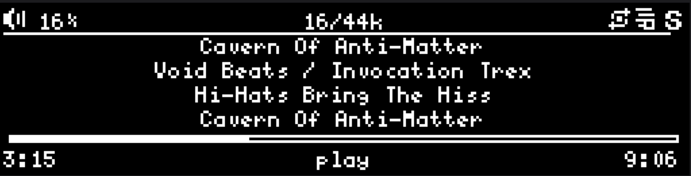 | 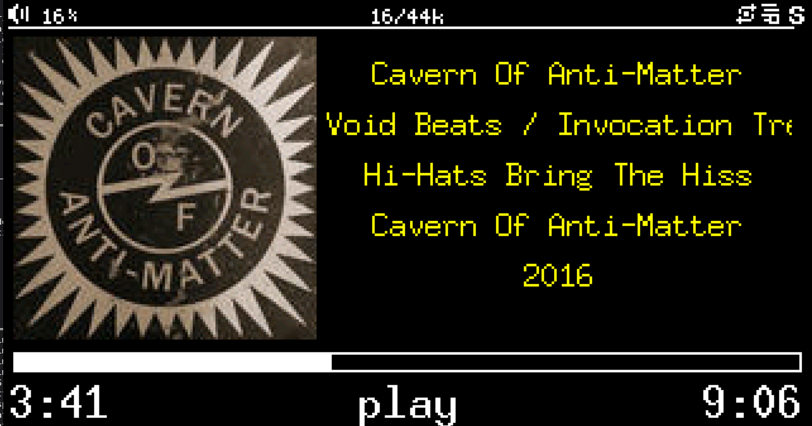 |

TTF font on ST7789:

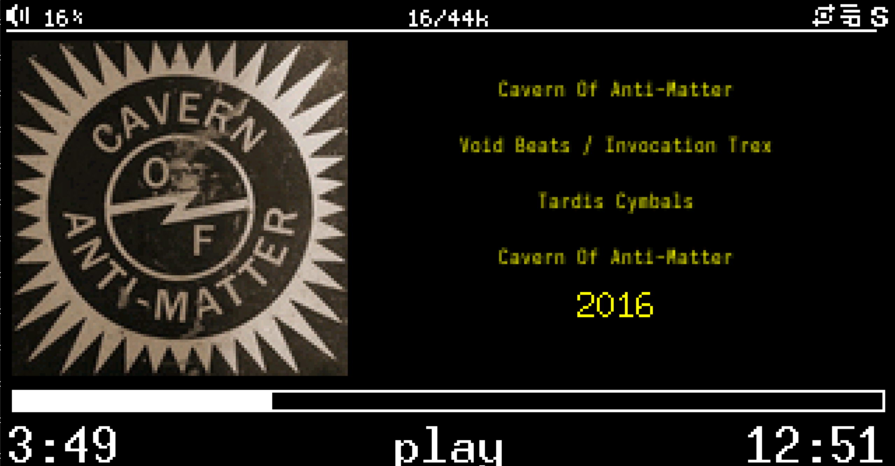

### Clock, Marvel Font

| SSD1309 (128×64 mono) | SSD1322 (256×64 gray4) | ST7789 (320×170 color) |
|:---:|:---:|:---:|
| 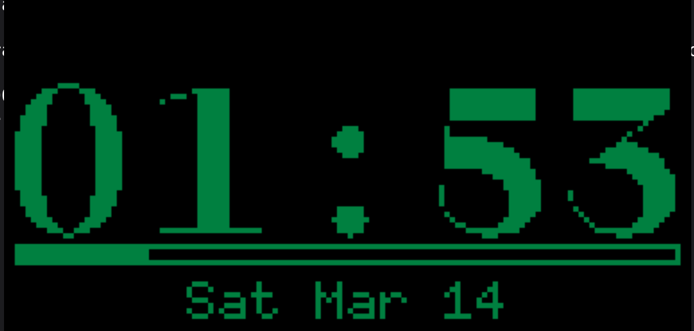 |  | 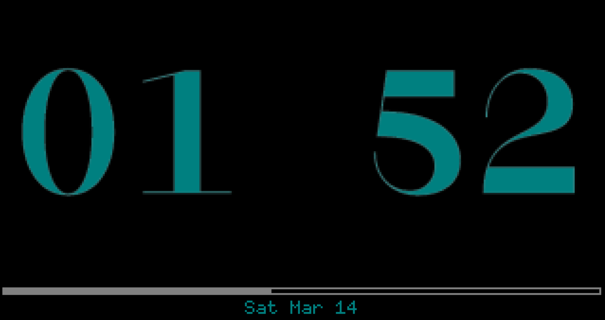 |

### Weather, Current Conditions

| SSD1322 (256×64 gray4) | ST7789 (320×170 color) |
|:---:|:---:|
| 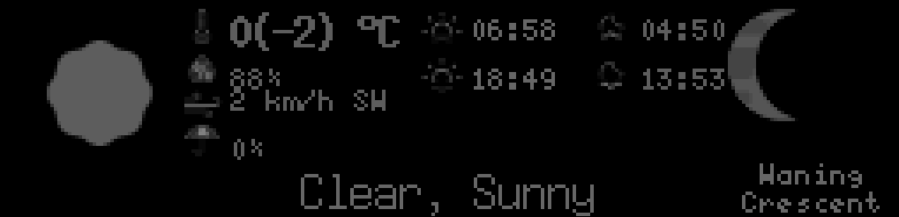 | 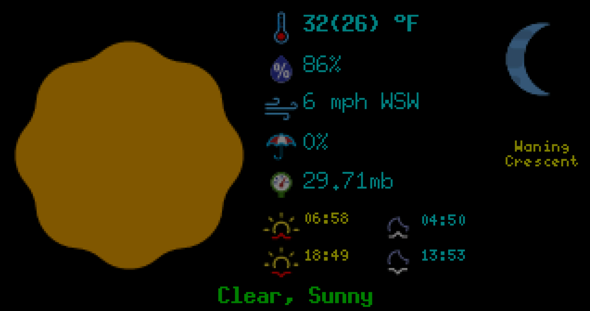 |

### Weather, Forecast

| SSD1309 (128×64 mono) | SSD1322 (256×64 gray4) | ST7789 (320×170 color) |
|:---:|:---:|:---:|
| 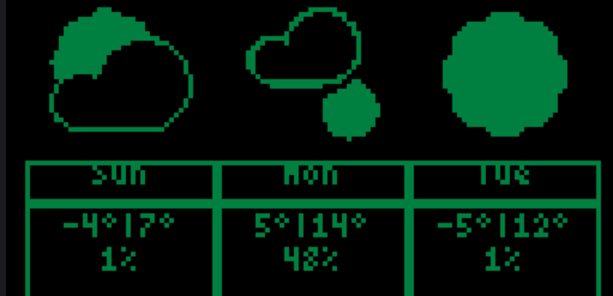 | 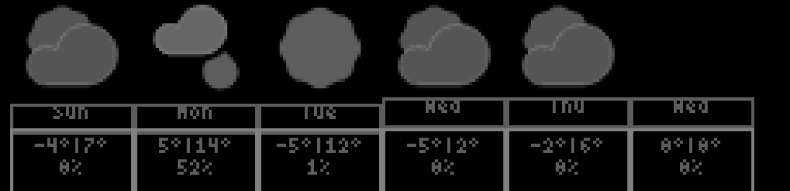 | 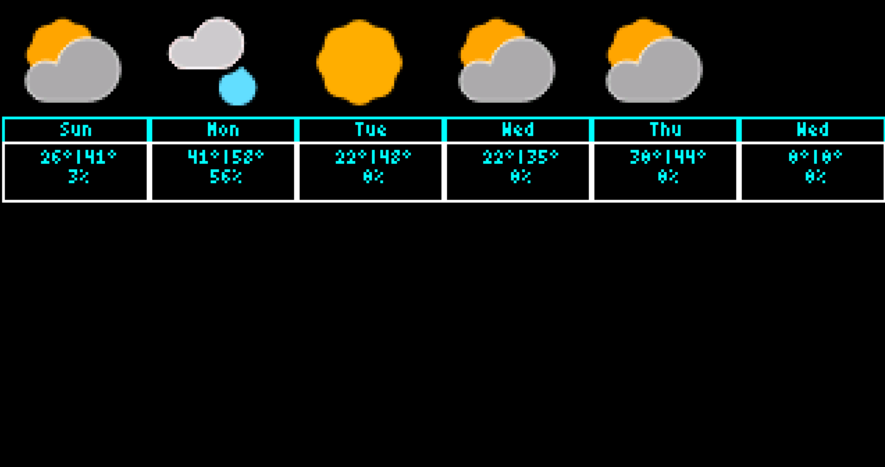 |

### Visualizer Modes

Several visualizer modes are supported:
- Stereo VU Meters - dBFS metered
- Stereo 12-band Spectrum Analysis
- Stereo 20-band Spectrum Analysis for wide displays
- Stereo Peak Meter - dBFS metered
- Downmix Peak Meter
- Large Downmix VU meter
- Large Downmix Spectrum
- All-In-One - track details alongside spectrum or VU meter
- Wave Forms - coming soon
- Easter Eggs - fixed mode (use `--egg <name>`)

## TTF Scrolling Fonts

By default LyMonS renders track details using its built-in bitmap fonts. You can replace these with any TrueType or OpenType font for richer text rendering, including full Unicode and CJK character support.

### How It Works

LyMonS loads a TTF/OTF font from a zip archive at startup. The archive can contain a single font file (`.ttf` or `.otf`), LyMonS picks the first one it finds. Font metrics (ascent, descent, line height) are read directly from the font file, so vertical centering is always accurate regardless of the size you choose.

### Adding a Font

1. **Create the zip archive** containing your `.ttf` or `.otf` file:

    ```bash
    zip NotoSansMonoCJKjp-text.zip NotoSansMonoCJKjp-Regular.otf
    ```

2. **Place it in the `data/` folder** next to the LyMonS binary, named `{name}-text.zip`, the `{name}` part is how you refer to it on the command line or in the config file:

    ```
    data/
      NotoSansMonoCJKjp-text.zip
    ```

3. **Enable it** via CLI or config (see below).

### CLI

```bash
LyMonS --name myplayer -F NotoSansMonoCJKjp -f 24
```

| Flag | Description |
|---|---|
| `-F` / `--text_font` | Font name - must match `data/{name}-text.zip` |
| `-f` / `--text_font_size` | Point size (floating point) |

### Config File

```yaml
text_font: NotoSansMonoCJKjp
text_font_size: 24
```

### CJK Fonts

For Japanese, Chinese (Simplified, Traditional, Hong Kong), and Korean text, the **Noto Sans Mono CJK** family is an excellent choice. It is open source, metrically consistent, and covers all CJK scripts in a single font family.

> **Note:** CJK fonts contain a very large glyph set and require a minimum rendered size to be legible. A point size of **24 or above** is recommended; smaller sizes may fail to load or render poorly but this is also screen size dependent - YMMV.

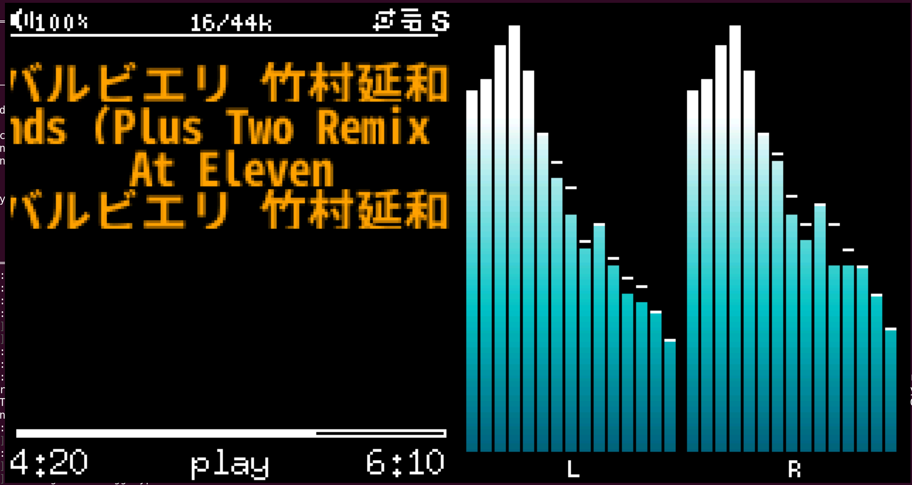

*Japanese track metadata rendered at 24pt on ST7789 (320×170 color) in AIO histogram mode.*

#### Noto Sans Mono CJK Variants

| Font | Script |
|---|---|
| `NotoSansMonoCJKjp` | Japanese |
| `NotoSansMonoCJKkr` | Korean |
| `NotoSansMonoCJKsc` | Simplified Chinese |
| `NotoSansMonoCJKtc` | Traditional Chinese |
| `NotoSansMonoCJKhk` | Hong Kong Chinese |

Fonts can be found on the web or downloaded from the official Noto CJK GitHub repository:

- **Repository**: https://github.com/notofonts/noto-cjk/tree/main
- **Download page**: https://github.com/notofonts/noto-cjk/tree/main/Sans#downloading-noto-sans-cjk

Download the **Mono** variant in OTF format, zip the `.otf` file, and drop it in the `data/` folder as described above.

### Installation

LyMonS can run in two configurations:

**On the player device**, installed directly on a piCorePlayer or any Pi running Squeezelite. LyMonS reads audio data from Squeezelite's shared memory, which gives it access to real-time PCM data for VU meters, peak meters, and spectrum analysis.

**On a separate device**, installed on another machine on the same network, pointing at the LMS player by name. In this case LyMonS connects to the [visionon](https://github.com/shunte88/visionon) streaming daemon running on the player device and receives audio metrics over the network. LyMonS figures out which approach to use on its own, if shared memory is available it uses it, otherwise it connects to visionon. No flags, no configuration switches.

The only thing you need for remote visualization is the visionon daemon running on the player device. Point LyMonS at the player name and the rest is handled for you.

# Prerequisites

If you intend to use visualization you need to configure Squeezelite to expose its shared memory.

From the Squeezelite page of the pCP web frontend, type `1` in the "m" ALSA parameter section and add `-v` in the Various Options field.

See the Squeezelite page for more details.

For **remote visualization** (LyMonS on a separate device), you also need the [visionon](https://github.com/shunte88/visionon) daemon running on the player device. Visionon is a lightweight process that reads Squeezelite's shared memory and streams the audio metrics out over HTTP. Once it's running, LyMonS connects to it automatically using the player's IP.

## Easter Eggs

There are several "easter egg" modes for setups that can't or don't want to process audio data for visualization. There's nothing stopping you using them as your main display mode either.

#### Cassette

| SSD1309 (128×64 mono) | SSD1322 (256×64 gray4) | ST7789 (320×170 color) |
|:---:|:---:|:---:|
| 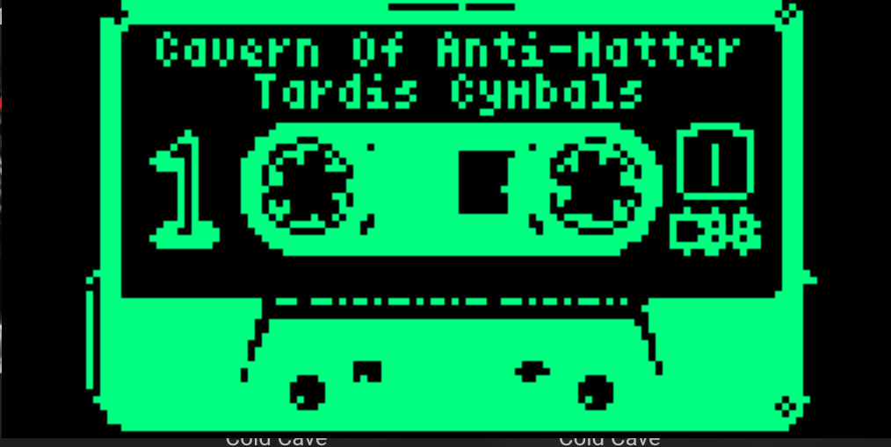 | 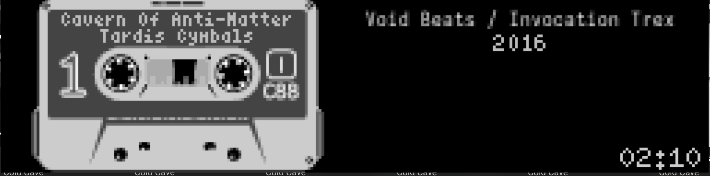 | 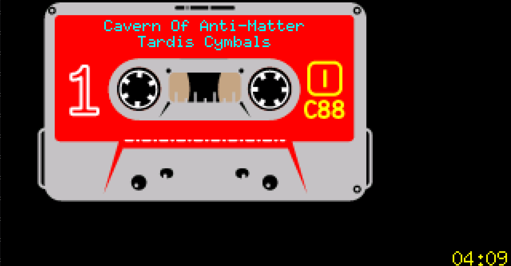 |

#### Oscilloscope

| SSD1309 (128×64 mono) | SSD1322 (256×64 gray4) | ST7789 (320×170 color) |
|:---:|:---:|:---:|
| 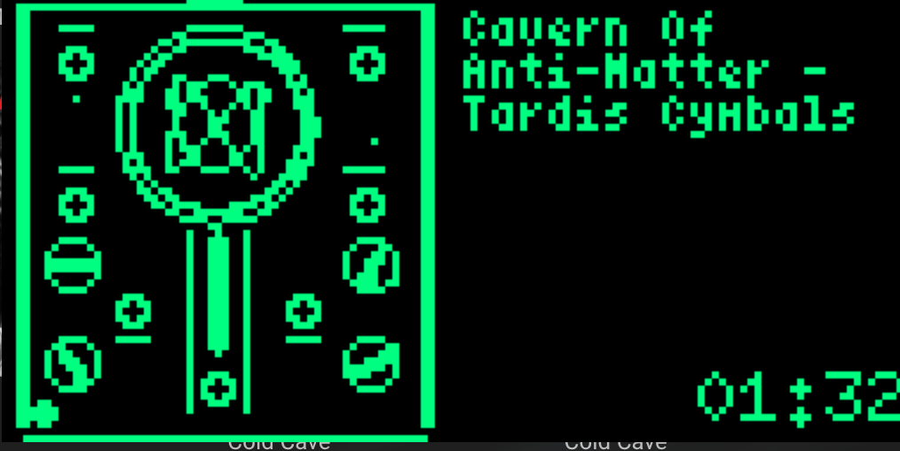 | 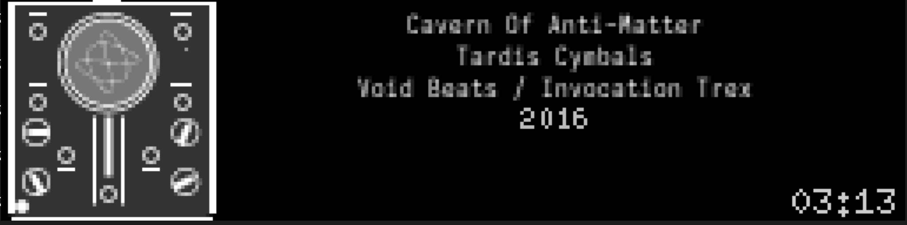 | 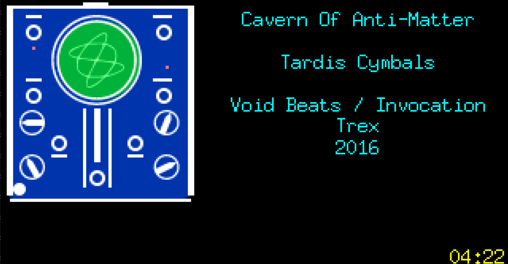 |

There are currently 10 easter egg modes:
- <b>[cassette]</b> Compact Cassette, as visually accurate as the OLED allows. Hubs turn and the tape loops from one hub to the other with the tape window showing track progress.
- <b>[technics]</b> Technics SL-1200, as visually accurate as the OLED allows. Tone arm traverses the platter to indicate progress.
- <b>[reel2reel]</b> Open Reel To Reel, pure fantasy. Reels rotate, minor animation.
- <b>[vcr]</b> VCR with flashing 12:00 AM clock. No additional animation - the clock is annoying enough.
- <b>[radio40]</b> A large ornate radio. Minor animation, station changes as the track progresses.
- <b>[radio50]</b> An old Bakelite radio. Minor animation, station changes as the track progresses.
- <b>[tvtime]</b> An old analog TV in all its 5x4 glory. VHF or UHF - no, a dancing news reader.
- <b>[ibmpc]</b> A crusty old IBM PS/2 clone. Simple starfield animation, just for fun.
- <b>[bass]</b> A rubbish bass guitar or bass ?? - and why not.
- <b>[pipboy]</b> It's Pip-Boy.

Specify `--egg <name>` to display an easter egg during track playback.

## Supported Displays

Each driver speaks a single bus and a single color depth. Color depth is a
property of the **driver**, not the panel size, choosing `--driver st7789`
implies Rgb565 even on a 240×135 panel; `--driver ssd1322` implies Gray4
regardless of physical dimensions.

| Driver        | Bus     | Color depth | Panel sizes (long × short)                 |
|---------------|---------|--------------|--------------------------------------------|
| `ssd1306`     | I²C/SPI | Mono (1bpp)  | 128×64                                     |
| `ssd1309`     | I²C/SPI | Mono (1bpp)  | 128×64                                     |
| `sh1106`      | I²C/SPI | Mono (1bpp)  | 132×64                                     |
| `sh1107`      | I²C/SPI | Mono (1bpp)  | 128×128, 128×64                            |
| `ssd1322`     | SPI     | Gray4 (4bpp) | 256×64                                     |
| `sh1122`      | SPI     | Gray4 (4bpp) | 256×64                                     |
| `st7789`      | SPI     | Rgb565 (16bpp) | 320×240, 320×170, 280×240, 240×240, 240×135, 160×80 |
| `st7796s`     | SPI     | Rgb565 (16bpp) | 480×320                                    |
| `sharpmemory` | SPI     | Mono (1bpp)  | 400×240                                    |

### Specifying Panel Size

For drivers with more than one panel option (currently `st7789` and `sh1107`;
`st7796s` will follow if/when alternative panel sizes are supported), set
`width` and `height` in the `display:` block of your config file:

```yaml
display:
  driver: st7789
  width:  240
  height: 240
```

The configurator validates the requested size against the supported list and
fails fast with a clear message if it doesn't match. For drivers with a single
panel (e.g. `ssd1322`) the size is fixed and the values are ignored.

### SH1107 Mounting

The SH1107 carries a full 128×128 of display RAM whatever the panel in front of
it, and it has no hardware 90° rotation, only segment remap and COM scan
direction. LyMonS therefore rotates in software while packing the framebuffer
into controller RAM, so all four angles are available:

```yaml
display:
  driver: sh1107
  width:  128
  height: 64
  rotate_deg: 90     # 0 | 90 | 180 | 270
```

Many 128×64 SH1107 modules are a portrait 64×128 panel mounted sideways. Start
at `rotate_deg: 0`; if the image reads sideways, try `90`, then `270`. The
128×128 panels are square and need no rotation.

### Orange Pi and other non-Pi boards

LyMonS talks to hardware through the generic Linux character devices - 
`/dev/i2c-*`, `/dev/spidev*` and `/dev/gpiochip*`  - so it is not tied to
Broadcom silicon and runs unmodified on Orange Pi. Everything that differs is
configuration, not code.

#### Supported boards

| Board                                           | SoC              | Package             | GPIO layout |
|-------------------------------------------------|------------------|---------------------|-------------|
| Orange Pi 5 / 5B / 5 Plus / 5 Pro / 5 Max / CM5 | RK3588 / RK3588S | `-opi-aarch64`      | Rockchip    |
| Orange Pi 3B                                    | RK3566           | `-opi-aarch64`      | Rockchip    |
| Orange Pi 4 / 4 LTS                             | RK3399           | `-opi-aarch64`      | Rockchip    |
| Orange Pi Zero 3 / Zero 2W                      | Allwinner H618   | `-opi-aarch64`      | Allwinner   |
| Orange Pi Zero / Zero LTS, PC, PC Plus, One     | H2+ / H3         | `-pcp-armv7`        | Allwinner   |

Every current Orange Pi is 64-bit, so one `-opi-aarch64` package covers the
Rockchip and Allwinner boards alike  - they differ only in GPIO line numbering.
The older 32-bit H2+/H3 boards take the Raspberry Pi `armv7` package; the binary
is architecture-compatible and the bus setup below still applies.

#### Install

```bash
wget https://github.com/shunte88/LyMonS/raw/binaries/latest/lymons-latest-opi-aarch64.tgz
tar xzf lymons-latest-opi-aarch64.tgz
cd lymons-*-opi-aarch64
sudo ./install.sh
```

The installer deploys to `/usr/local/bin`, `~/lymons` and
`/usr/local/lib/lymons/drivers`, writes a starter `lymons.yaml` with Orange Pi
bus paths, generates a `gomonitor` launch script, and adds you to the `i2c`,
`spi` and `gpio` groups.

#### 1. Enable the bus

There is no `raspi-config` and no `/boot/config.txt`. On Armbian, enable an
overlay in `/boot/armbianEnv.txt`  - `armbian-config` → System → Hardware lists
the overlays your board supports  - then reboot:

```
overlays=i2c5-m3 spi4-m0-cs1-spidev
```

#### 2. Find your buses

The package ships **`show-buses.sh`** (installed to `~/lymons/show-buses.sh`),
which is the fastest way to fill in the `bus:` block. It lists the `/dev/i2c-*`
buses, `/dev/spidev*` nodes and GPIO controllers your board actually exposes,
scans each I²C bus for devices if `i2c-tools` is installed, and prints the line
numbering rule for your SoC:

```bash
~/lymons/show-buses.sh
```

Orange Pi does not put the header I²C on `/dev/i2c-1`. The Orange Pi 5 family
commonly exposes `i2c5` on header pins 3/5; the 3B and Zero 3 use `i2c3`.

```yaml
display:
  driver: sh1107
  width:  128
  height: 128
  bus:
    type: i2c
    bus: "/dev/i2c-5"
    address: 0x3C
```

#### 3. GPIO pins are not BCM numbers

For SPI panels this is the one thing that will silently drive the wrong pin if
you carry a Raspberry Pi config across.

On a Pi the whole 40-pin header is a single GPIO controller whose cdev line
offsets happen to equal the BCM numbers, so `dc_pin: 24` means BCM 24 and no
controller needs naming. Orange Pi has neither property.

**Rockchip** (5 family, 3B, 4) registers one controller per bank  - `gpio0` …
`gpio4`, 32 lines each:

```
line = group * 8 + index        (group A=0, B=1, C=2, D=3)
PC7  = 2 * 8 + 7 = 23           on bank 3
```

**Allwinner** (Zero 3, Zero 2W) has two controllers  - the main pinctrl and the
R_PIO carrying the PL bank  - each numbered flat across its banks:

```
line = bank * 32 + index        (bank A=0, B=1, C=2 … I=8)
PC7  = 2 * 32 + 7 = 71          on the main pinctrl
PL10 = 10                       on the R_PIO controller
```

Name the controller with `gpio_chip` and give the matching line:

```yaml
display:
  driver: sh1107
  bus:
    type: spi
    bus: "/dev/spidev4.0"
    gpio_chip: "gpio3"    # Rockchip bank label; "300b000.pinctrl" on H618
    dc_pin: 23            # bank-relative line, NOT a BCM number
    rst_pin: 24
    speed_hz: 8000000
```

`gpio_chip` accepts a controller label (`gpio3`, `300b000.pinctrl`,
`pinctrl-rp1`), a device node (`/dev/gpiochip3`) or a bare number (`3`). Labels
are device-tree node names and vary by SoC, so read them from `show-buses.sh`
rather than assuming.

The field is optional and unnecessary on a Pi, where the header controller is
still found by label (`pinctrl-rp1`, `pinctrl-bcm2711`, `pinctrl-bcm2835`,
`pinctrl-bcm2708`) whatever number the kernel gave it. When no known controller
matches, LyMonS falls back to `/dev/gpiochip0` and logs every controller the
kernel exposes, so the fix is visible in the startup log:

```
WARN  No Raspberry Pi header GPIO controller found; falling back to /dev/gpiochip0
WARN  On Orange Pi / Rockchip, Allwinner and other boards set display.bus.gpio_chip ...
WARN    available GPIO controller: gpio0 (/dev/gpiochip0, 32 lines)
WARN    available GPIO controller: gpio3 (/dev/gpiochip3, 32 lines)
```

Plugin drivers are loaded as shared objects and never see the YAML config; set
`LYMONS_GPIO_CHIP=gpio3` in the environment for those.

#### Helper scripts

| Script | Where | Purpose |
|--------|-------|---------|
| `show-buses.sh` | in the package, installed to `~/lymons/` | List I²C buses, SPI nodes and GPIO controllers; scan I²C for devices; print the SoC's line-numbering rule |
| `install.sh` | in the package | Deploy binary, drivers and assets; write starter config and `gomonitor`; join the `i2c`/`spi`/`gpio` groups |
| `scripts/cross-compile-opi.sh` | repo | Cross-compile the workspace for `aarch64-unknown-linux-gnu` |
| `scripts/create-opi-package.sh` | repo | Build the `lymons-X.Y.Z-opi-aarch64.tgz` deployment package |

From a source checkout, `make cross_opi` builds and `make release_opi` builds
and packages. CI does the same in the `build-opi` job. Full detail in
[CROSS_COMPILE.md](CROSS_COMPILE.md).

### Orientation and Rotation

LyMonS treats every framebuffer as **landscape-canonical**: the longer axis is
always width, the shorter axis is always height. If you supply portrait
dimensions in YAML, e.g. `width: 135, height: 240` for a 240×135 ST7789, the
driver normalises silently and logs:

```
ST7789: normalised input 135x240 → 240x135 (long axis first)
```

As the dimension take the longest side as the width you may need to rotate the
display image so that we correctly display your information. 
Physical orientation is then handled by `rotate_deg` (`0`, `90`, `180`, `270`),
which rotates the rendered framebuffer when blitted to the panel. This means
the layout YAML never needs portrait-specific variants, author once in
landscape and rotate at the panel.

### SVG and Scaling

Most pixel-bearing assets in LyMonS are SVG (clock digits, weather glyphs,
easter eggs, status icons, peak meters). They scale cleanly to whatever panel
size the driver reports. Layout YAML, however, currently carries
**hand-tuned absolute coordinates** for the canonical panel size of each
driver, so a non-canonical ST7789 size (anything other than 320×170) will
render but field positions and widths may need attention. Add a sized layout
override using a **dimensional variant** named `{width}x{height}` (for example
`240x240`) within the driver's `layout.yaml`, see *Dimensional Variants*
below. The underlying SVGs themselves should require no changes.

## Layout System

LyMonS uses a declarative YAML layout system to define where and how every element appears on screen. All positions, sizes, fonts, colors, and alignment are data, and no recompilation needed. Driver-specific overrides let each display have its own tuned layout without touching shared definitions.

### How It Works

Layouts are defined in `assets/layout.yaml` (the base, targeting 128×64 mono displays). Driver-specific overrides are placed alongside the driver in `assets/{driver}/layout.yaml` - for example `assets/ssd1322/layout.yaml` for the 256×64 gray4 display, or `assets/st7789/layout.yaml` for the 320×170 color display.

When LyMonS starts it loads the base layout, then merges the driver override on top. The merge is **additive at the field level** - the override can add new fields or change individual field properties without having to redeclare fields it doesn't touch.

### Layout File Structure

```yaml
components:
  my_panel:                     # reusable group of fields
    fields:
      - name: status_bar
        type: status_bar
        x: "0"
        y: "2"
        width: "parent.width"
        height: "9"

templates:
  playback:                     # page shown during track playback
    variants:
      - name: default           # catch-all variant (no match: rule)
        regions:
          - component: my_panel
            x: "0"
            y: "0"
            width: "display.width"
            height: "display.height"
```

Simple pages like easter egg overlays can define fields inline directly in the variant, skipping the component indirection entirely:

```yaml
templates:
  easter_egg_cassette:
    variants:
      - name: default
        fields:
          - name: artist
            type: label
            x: "18"
            y: "6"
            width: "90"
            height: "6"
            font: font_4x6
            horizontal_alignment: Center
```

### Expressions

Position and size values are expression strings, not bare numbers. The following variables are available:

| Variable | Meaning |
|---|---|
| `display.width` | Full display width in pixels |
| `display.height` | Full display height in pixels |
| `parent.width` | Width of the enclosing region |
| `parent.height` | Height of the enclosing region |
| `font_height` | Character height of the field's font |
| `<name>.top` `.bottom` `.left` `.right` `.width` `.height` | Geometry of any previously defined field |

Arithmetic operators `+` `-` `*` `/` and parentheses are supported. Examples:

```yaml
x: "display.width / 2"              # centre of display
y: "status_bar.bottom + 2"          # 2px below the status bar
width: "display.width - 43"         # fill to near right edge
height: "parent.height - 16"        # leave room for time at bottom
```

Because expressions reference `display.width`, the same component definition often adapts correctly to both 128px and 256px displays without a driver override.

### Field Properties

| Property | Values | Default |
|---|---|---|
| `type` | `label`, `scrolling_text`, `status_bar`, `track_progress_bar`, `info_line`, `clock_digits`, `weather_icon`, `weather_glyph`, `cover_image`, `custom` |, |
| `x` / `y` | integer or expression | `"0"` |
| `width` / `height` | integer or expression | `"parent.width"` / `"0"` |
| `font` | `font_4x6` `font_5x8` `font_6x10` `font_7x13` `font_7x13_bold` `font_10x20` etc. | type default |
| `fg_color` | `White` `Yellow` `Cyan` `Red` `Green` `Blue` `Orange` `Magenta` or `{r, g, b}` | `White` |
| `scrollable` | `true` / `false` | `false` |
| `horizontal_alignment` | `Left` `Center` `Right` | `Left` |
| `vertical_alignment` | `Top` `Middle` `Bottom` | `Top` |

### Variant Matching

A template can have multiple variants selected by display characteristics. The first matching variant wins; an entry with no `match:` block is a catch-all.

```yaml
templates:
  weather_forecast:
    variants:
      - name: color               # matches ST7789 specifically
        match:
          color_depth: [Rgb565]
        regions:
          - component: weather_forecast_6col_st7789
            ...

      - name: wide                # matches SSD1322 / SH1122
        match:
          category: [Large]
        regions:
          - component: weather_forecast_ext_cols
            ...

      - name: default             # all other displays
        regions:
          - component: weather_forecast_3col
            ...
```

Match filters:

| Filter | Values |
|---|---|
| `category` | `Small` (128px), `Medium` (132px), `Large` (256px), `ExtraLarge` (320px+) |
| `color_depth` | `Monochrome`, `Gray4`, `Rgb565` |

### Dimensional Variants

A variant whose **name** is exactly `{width}x{height}` (e.g. `240x240`,
`320x170`) is matched as an exact size override and wins over every other
variant, no `match:` block required. This lets you ship a hand-tuned layout
for a specific panel size without disturbing the catch-all `default` variant
that other sizes fall back to.

```yaml
templates:
  weather_current:
    variants:
      - name: 240x240             # exact size match, wins on 240×240 panels
        regions:
          - component: weather_current_240x240
            ...
      - name: default             # everything else
        regions:
          - component: weather_current_main
            ...
```

Resolution order: dimensional name match → variant with a matching `match:`
block → first catch-all. Authoring convention: put dimensional variants and
specific match-rule variants first, leave the catch-all `default` last.

### Driver Overrides

Place a `layout.yaml` file inside the driver's asset folder. The file uses the same format as the base, it only needs to contain what differs. Components and templates not mentioned in the override are inherited unchanged from the base.

**Example**: add artist and title to the Pip-Boy easter egg on the wide gray4 display, which shows only a clock by default:

```yaml
# assets/ssd1322/layout.yaml
templates:
  easter_egg_pipboy:
    variants:
      - name: default
        fields:
          - name: artist          # new, not in base template
            type: label
            x: "140"
            y: "3"
            width: "114"
            height: "28"
            font: font_4x6
            horizontal_alignment: Center
          - name: title           # new, not in base template
            type: label
            x: "140"
            y: "33"
            width: "114"
            height: "20"
            font: font_4x6
            horizontal_alignment: Center
          # time field is inherited from base, no need to redeclare it
```

### Easter Egg Field Names

Each easter egg template supports any combination of the following named fields. Fields not present in the template are simply not rendered, add whichever ones make sense for the available screen space on each display.

| Field name | Content |
|---|---|
| `artist` | Track artist |
| `title` | Track title |
| `album` | Album name |
| `album_artist` | Album artist |
| `combination` | `"Artist, Title"` combined scroller |
| `year` | Release year |
| `time` | Elapsed or remaining track time |

Set `scrollable: true` on any of these for a horizontal scroller (text slides when it overflows the field width). Use `type: label` with `scrollable: false` for word-wrapped static text.

### Error Reporting

Layout errors are reported at startup with enough context to find the problem quickly.

**YAML syntax or type error** (e.g. unknown font name, bad indentation):
```
ERROR layout: YAML error in ./assets/ssd1322/layout.yaml:
ERROR   unknown variant `font_4x66`, expected one of `font_4x6`, `font_5x7`, ...
ERROR   (in template 'easter_egg_pipboy')
WARN  layout: driver override ignored, using base layout only
```

**Expression evaluation error** (e.g. typo in a variable name, forward reference):
```
WARN  layout: easter_egg_reel2reel/default/time [x="display.widht - 43"]:
              unknown variable 'display.widht', using 0
```

## Like The App - Git The Shirt

Team Badger shirts and other goodies available at [shunte88](https://www.zazzle.com/team_badger_t_shirt-235604841593837420)

---

[ Like my work, then Buy Me A Coffee](https://buymeacoffee.com/shunte88)

